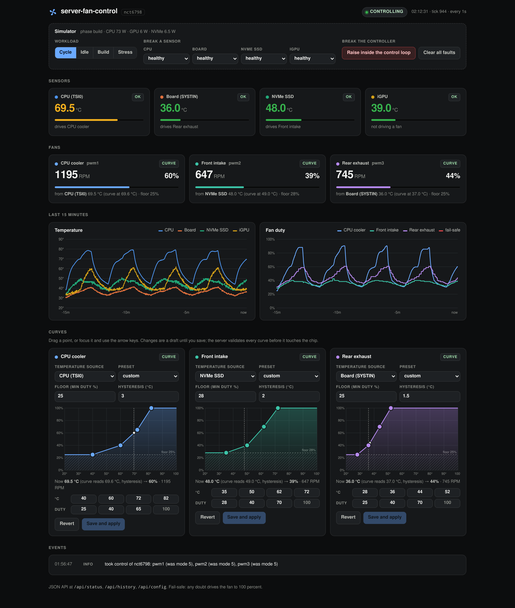
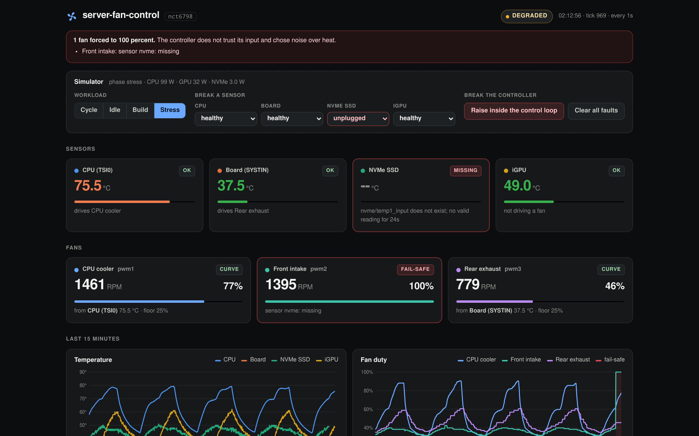
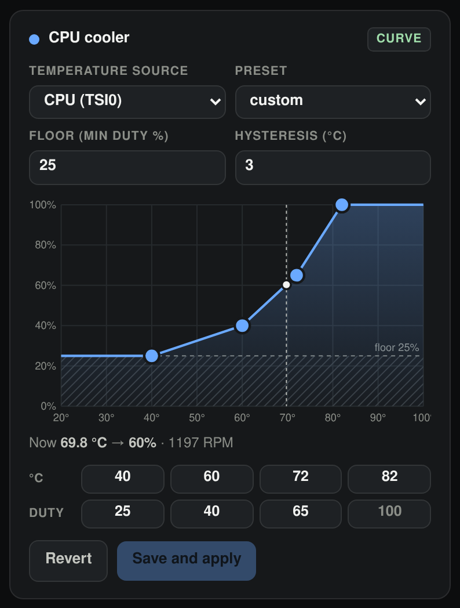

# server-fan-control

**Sets a server's fan speeds from the temperatures that matter, and runs every fan at full speed if anything fails.**

*In plain words:* Computers that run all day have fans to keep them cool, and those fans often spin at the wrong speed: too loud, or too slow for the part that is actually getting hot. This program lets each fan follow the temperature of the part it is there to cool. If a sensor stops answering or the program itself fails, every fan goes to full speed, because a loud server is better than a damaged one. A built in simulator lets anyone try it, dashboard included, on an ordinary laptop.

Fan curves for Linux hwmon chips, with a fail-safe that assumes the worst.
It drives the PWM channels of a Nuvoton NCT6798D (or any chip on the
`nct6775` driver, and most others with `pwmN`/`pwmN_enable` files), lets every
fan follow its own temperature source, and ships with a simulator so you can
run the whole thing, dashboard included, on a laptop with no fans to speak of.

Standard library only at runtime. Python 3.10 or newer.
The Python package, the command it installs and the systemd unit keep the
project's original short name: they are all called `fancurve`.



## Try it in one command

From a clone of this repository:

```bash
make demo                 # or: PYTHONPATH=src python3 -m fancurve.demo
```

Open <http://127.0.0.1:8790/> (if that port is taken, `make demo DEMO_PORT=8791`
and open that one instead). The dashboard has a single dark theme. The demo builds a fake `/sys/class/hwmon` tree
in a temporary directory, runs a thermal model against it, and puts the real
controller and dashboard on top. Nothing touches your actual hardware.

With Docker instead:

```bash
docker build -t server-fan-control .
docker run --rm -p 127.0.0.1:8790:8790 server-fan-control
```

The simulator panel at the top of the page lets you switch the workload
(idle, a build, a full stress run) and, more interesting, break things: unplug
the NVMe sensor, make the CPU sensor return garbage, freeze the board sensor,
or raise an exception inside the control loop. Watch what the fans do.

## Why I built it

I run a small home server in a closet: an AMD APU on a mini-ITX board, an NVMe
drive with the containers on it, three fans. With the BIOS curves I had two
options and I disliked both.

The default profile held every fan at 60 percent at idle and jumped to 100 the
moment the CPU touched 60 °C, which with a compile job in the background meant
a fan revving up and down every few minutes. On the "silent" profile it was
quiet, and one afternoon the NVMe drive reported 78 °C during a long backup.
The firmware could not have known: its curves only accept the CPU or the board
thermistor as input, and the drive that was cooking sits under the board,
right in the path of the front intake fan, which the BIOS was running from the
board sensor.

`fancontrol` from lm-sensors got me halfway. It can pair a fan with any hwmon
temperature, but each curve is a single straight line between a minimum and a
maximum, and I wanted a flat, quiet stretch at idle followed by a steep climb
where the drive actually starts to suffer.

So I wrote this. The intake fan now follows the NVMe temperature, the CPU fan
follows the CPU, the exhaust follows the board, each on a four point curve with
a little hysteresis, and anything the controller does not understand ends with
the fan at full speed. At idle the box is quieter than it ever was with the
BIOS, and the drive has not gone above 55 °C since.

## What it does

- **Multi point curves per fan.** Two to eight points (the presets use four),
  linear in between, flat beyond the ends.
- **A temperature source per fan.** Any `tempN_input` of any hwmon chip: CPU,
  board, NVMe, GPU, whatever the kernel exposes.
- **Hysteresis.** Speeds go up immediately and come down only after the
  temperature has dropped a configurable number of degrees. No more hunting
  around a curve point.
- **A minimum duty floor per fan**, because most fans stall somewhere around
  20 percent and a stalled fan looks exactly like a fan at 20 percent to
  anything that is not reading the tachometer.
- **Fail-safe to full speed** on every failure it can detect (see below), and
  a hand back to the chip's own automatic mode on exit.
- **Web dashboard** with live readings, 15 minutes of history, and a
  draggable SVG curve editor that works with the keyboard too.
- **JSON API** behind an optional bearer token, bound to loopback by default.
- **Strict config validation** that reports every problem in one pass, with
  the path of the offending field.
- **A simulator** (`python -m fancurve.sim`) that fakes the whole hwmon tree
  with a thermal model: heat load, fan cooling, sensor lag, tachometer lag,
  fans that stall below their start duty.

## Safety design

The rule behind every decision: when in doubt, the fan runs at full speed.
Noise is an annoyance. An SSD that throttles, or worse, in a closet nobody
opens is damage.

| What goes wrong | What the controller does |
| --- | --- |
| Sensor file disappears (driver unloaded, drive removed) | Keeps using the last good reading for `stale_after_s`, then drives every fan that uses that sensor to 100 percent |
| Sensor returns garbage (`N/A`, empty, not an integer) | Same: bridge briefly, then 100 percent |
| Sensor reads an impossible value (an open thermistor reads -55 °C) | Treated as a failed read, outside `min_valid_c`..`max_valid_c` |
| Sensor never produced a valid reading | 100 percent immediately, no grace period |
| Sensor value stops changing (`frozen_after_s`, opt-in) | 100 percent. Off by default because quantized sensors can sit still for minutes at idle |
| Any exception inside a control tick | Every fan to 100 percent, the error goes to the event log, the next healthy tick resumes the curves |
| A PWM write fails on one channel | Every fan to 100 percent. Each channel is forced independently, so one dead channel cannot stop the others |
| The control loop stops ticking (deadlock, a hung read) | A separate watchdog thread notices after `watchdog_s` and writes 100 percent directly, without waiting for the loop's lock |
| Something flips a channel back to automatic (firmware after resume, another tool) | Manual mode is re-asserted on every tick |
| The controlled chip is not there at start | Waits, reports `waiting`, and takes control as soon as it appears |
| The process exits normally, on SIGTERM or on an unhandled exception | The original `pwmN_enable` modes are restored, so the chip's own curves take over |
| The process is killed with `kill -9` | The original modes were saved to a state file at startup; `ExecStopPost=fancurve restore` puts them back |
| Restoring automatic mode fails | The channel is left in manual at 100 percent, never at our last duty |

A few things are deliberate refusals rather than reactions. Config validation
rejects a curve whose duty ever decreases as temperature rises, and a curve
whose last point is not 100 percent: a curve that can never reach full speed
is a bug waiting for a hot day. Unknown keys are errors too, so a misspelled
`min_pmw` cannot silently leave a fan without its floor. The dashboard's
curve editor enforces the same rules while you drag, and the server checks
again before anything reaches the chip.



## How the loop works

Every `interval_s` (2 seconds by default) the controller:

1. reads every configured sensor and folds the result into that sensor's
   track: `ok`, `holding` (bridging a gap with the last good value), or one of
   `missing`, `garbage`, `out_of_range`, `io_error`, `frozen`;
2. for each fan, takes its source temperature through the hysteresis band,
   looks the result up on the curve, applies the floor, and converts percent
   to the kernel's 0..255 range;
3. makes sure the channel is in manual mode (`pwmN_enable = 1`) and writes
   `pwmN`;
4. appends a sample to the in-memory history the dashboard charts.

Hysteresis is a backlash on the input, not on the output. With a 3 °C band, a
CPU that climbs to 70 °C sets the fan to the curve value for 70. If it then
drifts between 67 and 70 nothing changes; once it drops below 67 the curve is
read at the current temperature plus 3. Rising temperatures always pass
straight through, so the band never delays cooling.



The dashed line is the live source temperature, the white dot is where the
fan actually is. When they differ horizontally, that gap is the hysteresis at
work. The hatched band is the floor.

## Running it on real hardware

You need root, since the PWM files under `/sys` are root-writable only, and
nothing else may be driving the same channels. Disable `fancontrol` if it is
installed.

```bash
sudo python3 -m venv /opt/fancurve
sudo /opt/fancurve/bin/pip install .
sudo mkdir -p /etc/fancurve
sudo cp examples/config.example.json /etc/fancurve/config.json
```

Find your chip and channels. `sensors` from lm-sensors helps, and so does:

```bash
grep . /sys/class/hwmon/hwmon*/name
```

Edit `/etc/fancurve/config.json`, then ask the controller what it sees. This
reads only; it writes nothing:

```bash
/opt/fancurve/bin/fancurve check -c /etc/fancurve/config.json
```

```
config OK: 4 sensors, 3 fans
chips under /sys/class/hwmon:
  hwmon0   nct6798
  hwmon1   nvme
  hwmon2   amdgpu
controlled chip 'nct6798': found
  sensor cpu         46.0 C  ok
  sensor system      33.5 C  ok
  sensor nvme        40.0 C  ok
  sensor gpu         40.0 C  ok
  fan cpu_fan    pwm1 mode=5 rpm=1196 source=cpu
  fan intake     pwm2 mode=5 rpm=905 source=nvme
  fan exhaust    pwm3 mode=5 rpm=969 source=system
```

For the dashboard token, put at least 16 random characters in the file named
by `web.token_file`:

```bash
sudo sh -c 'umask 077; python3 -c "import secrets; print(secrets.token_urlsafe(24))" > /etc/fancurve/token'
```

Then install the unit from [`deploy/fancurve.service`](deploy/fancurve.service).
It runs `fancurve run`, restores automatic mode in `ExecStopPost=` (which also
covers crashes and `kill -9`), declares `Conflicts=fancontrol.service`, and
keeps the rest of the filesystem read-only.

To see what a curve change would do before trusting it with the real chip,
run the controller against the simulator tree instead:

```bash
make sim                                          # terminal 1: fake tree in ./sim-sysfs
PYTHONPATH=src python3 -m fancurve run -c examples/config.sim.json   # terminal 2
```

The standalone simulator takes faults and workloads from
`./sim-sysfs/sim-control.json`, for example
`{"workload": "stress", "faults": {"nvme": "missing"}}`.

### A note on `pwmN_enable`

The meaning of the mode numbers is driver specific. For the `nct6775` family:
0 is full speed, 1 is manual, 2 to 5 are the chip's own automatic modes (5 is
Smart Fan IV, which is what most boards ship with). The controller records the
mode each channel was in before taking it and restores exactly that. The
`auto_mode` setting is only used when the original mode is unknown, for
example when a previous run died and left a channel in manual. If your chip
uses a different driver, check its documentation under
`Documentation/hwmon/` in the kernel tree and set `auto_mode` accordingly.

## Configuration

JSON, validated in full on load and on every change from the API. See
[`examples/config.example.json`](examples/config.example.json).

| Key | Meaning | Default |
| --- | --- | --- |
| `sysfs_root` | Where to look for `class/hwmon`. Point it at a simulator tree for testing | `/sys` |
| `chip` | `name` of the hwmon chip that owns the PWM channels | required |
| `interval_s` | Control period, 0.5 to 30 | 2 |
| `auto_mode` | Fallback `pwmN_enable` value when handing back | 5 |
| `state_file` | Where the original modes are saved for `fancurve restore` | none |
| `sensors.<id>` | `chip`, `input` (a `tempN_input`), `label` | |
| `fans.<id>.channel` | PWM channel number, 1 to 7, unique | required |
| `fans.<id>.source` | A sensor id | required |
| `fans.<id>.curve` | `[[temp_c, duty_pct], ...]`, temperatures strictly increasing, duty never decreasing, last point 100 | required |
| `fans.<id>.min_pwm` | Floor in percent | 20 |
| `fans.<id>.hysteresis_c` | Width of the hysteresis band, 0 to 15 | 2 |
| `failsafe.stale_after_s` | How long a failed sensor is bridged with its last good value | 6 |
| `failsafe.frozen_after_s` | Treat an unchanging sensor as dead after this long; 0 disables | 0 |
| `failsafe.min_valid_c` / `max_valid_c` | Plausible range; anything outside is a failed read | 0 / 120 |
| `failsafe.watchdog_s` | Loop silence before the watchdog forces full speed | 10 |
| `web.bind` / `web.port` | Dashboard address | `127.0.0.1` / 8790 |
| `web.token_file` | File holding the bearer token; unset means no auth | none |

## HTTP API

| Method and path | What it does |
| --- | --- |
| `GET /api/status` | Sensors with status and detail, fans with mode, duty, RPM, effective temperature, loop health, recent events |
| `GET /api/history?since=<unix time>` | Samples newer than `since` |
| `GET /api/config` | Sensors, fans, fail-safe settings and presets |
| `PUT /api/fans/<id>` | Any of `curve`, `source`, `min_pwm`, `hysteresis_c`, `label`. Validated, saved atomically, applied immediately. 400 with a list of errors otherwise |
| `POST /api/fans/<id>/preset` | `{"preset": "quiet" \| "balanced" \| "performance" \| "full"}` |
| `GET /healthz` | Liveness, no auth |

With a token configured, every `/api/` route needs
`Authorization: Bearer <token>`. The dashboard reads it from the
page URL as `?token=...`.

```bash
curl -s http://127.0.0.1:8790/api/status | python3 -m json.tool | head -20
curl -s -X PUT http://127.0.0.1:8790/api/fans/intake \
  -H 'Content-Type: application/json' \
  -d '{"curve": [[35, 30], [50, 45], [60, 75], [70, 100]], "hysteresis_c": 2}'
```

## Project layout

```
src/fancurve/
  hwmon.py        sysfs access, chips found by name, readings with a reason when they fail
  curve.py        interpolation, hysteresis, presets
  config.py       schema, validation, atomic save
  controller.py   the loop, every fail-safe path, take and release, watchdog
  server.py       stdlib HTTP server, JSON API, static files
  sim.py          fake hwmon tree and thermal model
  demo.py         simulator, controller and dashboard in one process
  web/            index.html, app.js, style.css (no build step, no dependencies)
tests/            pytest, all against fake sysfs trees in temporary directories
deploy/           example systemd unit
examples/         configs for real hardware and for the simulator
```

## Tests

```bash
python3 -m venv .venv && . .venv/bin/activate
pip install -e '.[dev]'
make test          # or: python3 -m pytest
make lint          # ruff
```

A virtual environment, because recent Debian and Ubuntu releases refuse a
plain `pip install` outside one.

The suite covers curve interpolation and hysteresis, every rule in config
validation, every fail-safe path in the table above (each one asserting what
lands in the `pwmN` file, not just what the controller believes), the HTTP
API including auth and rejected writes, the simulator's physics and fault
injection, and an end to end run of the demo. CI runs `ruff` and `pytest` on
Python 3.10 and 3.12, then starts the demo and checks it serves.

## Limitations

- It controls one chip. Sensors can come from any chip, fans only from the
  one named in `chip`, which covers every board I have seen.
- It does not detect a stalled fan from its tachometer yet. The floor is the
  defence for now.
- The dashboard is meant for a trusted network. The token keeps casual
  visitors out; it is not a substitute for a VPN or a reverse proxy with TLS
  if you expose it further.

## License

MIT, see [LICENSE](LICENSE).
